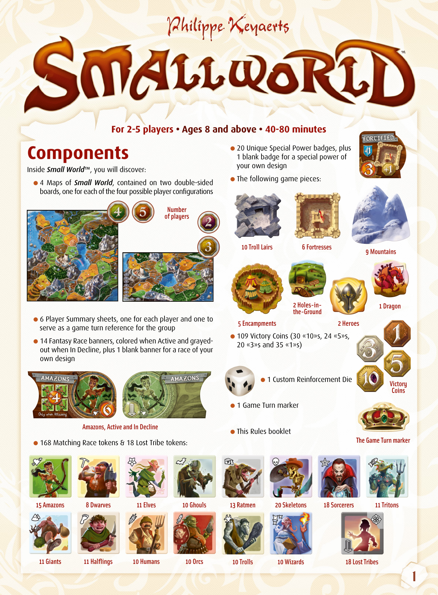

**For 2-5 players • Ages 8 and above • 40-80 minutes**

## **Components**

Inside _Small World_ ™, you will discover:

l 4 Maps of _Small World_, contained on two double-sided
boards, one for each of the four possible player configurations

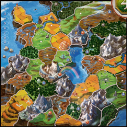

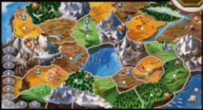

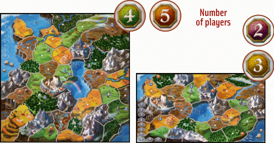

l 6 Player Summary sheets, one for each player and one to
serve as a game turn reference for the group

l 14 Fantasy Race banners, colored when Active and grayedout when In Decline, plus 1 blank banner for a race of your
own design

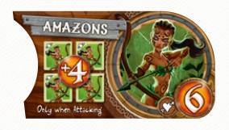

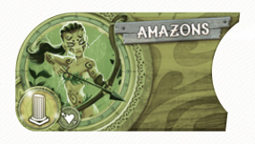

Amazons, Active and In Decline

l 168 Matching Race tokens & 18 Lost Tribe tokens:

15 Amazons 8 Dwarves 11 Elves 10 Ghouls

11 Giants 11 Halflings 10 Humans 10 Orcs

l 20 Unique Special Power badges, plus
1 blank badge for a special power of
your own design

l The following game pieces:

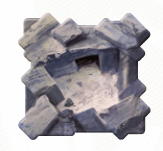

10 Troll Lairs

5 Encampments

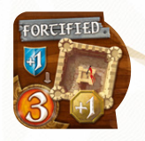

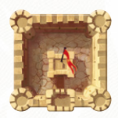

6 Fortresses
9 Mountains

2 Holes-inthe-Ground

2 Heroes

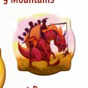

1 Dragon

Victory
Coins

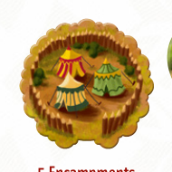

l 109 Victory Coins (30 «10»s, 24 «5»s,
20 «3»s and 35 «1»s)

l 1 Custom Reinforcement Die

l 1 Game Turn marker

l This Rules booklet

The Game Turn marker

13 Ratmen 20 Skeletons 18 Sorcerers 11 Tritons

10 Trolls 10 Wizards 18 Lost Tribes

#### **1**

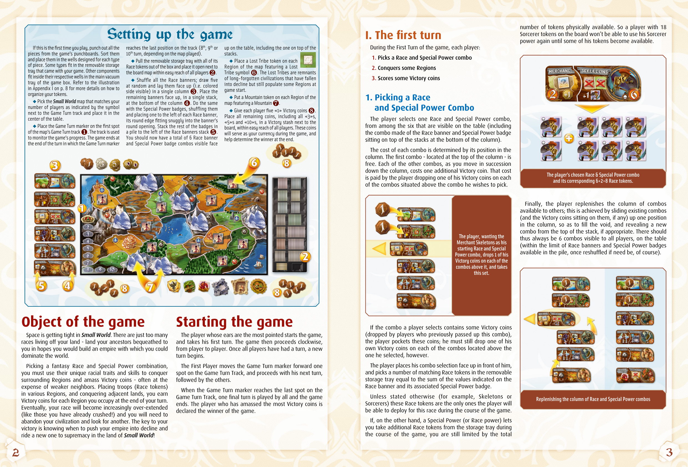

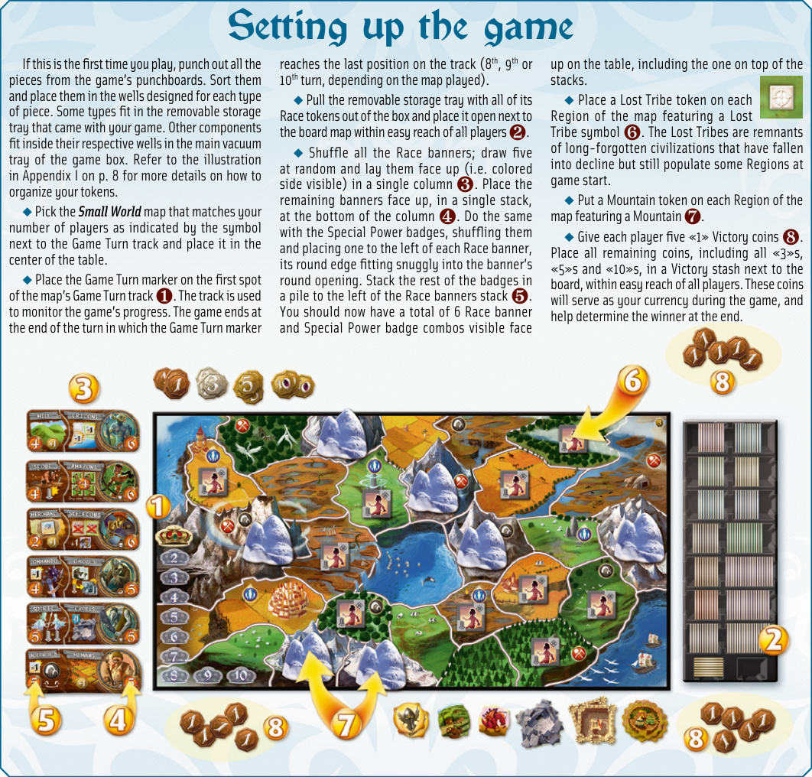

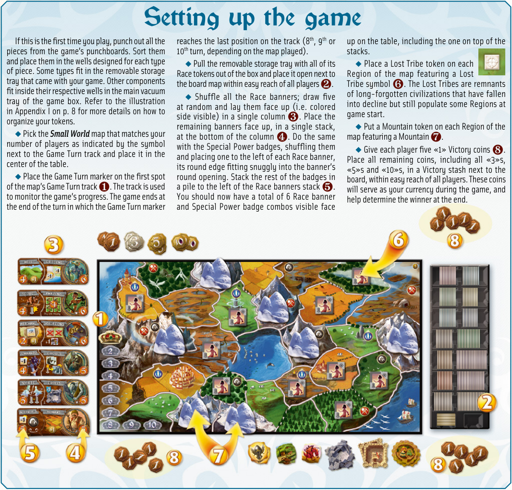

number of tokens physically available. So a player with 18
Sorcerer tokens on the board won’t be able to use his Sorcerer
power again until some of his tokens become available.

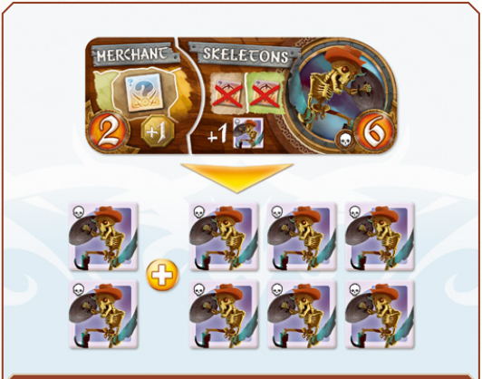

The player’s chosen Race & Special Power combo
and its corresponding 6+2=8 Race tokens.

Finally, the player replenishes the column of combos
available to others; this is achieved by sliding existing combos
(and the Victory coins sitting on them, if any) up one position
in the column, so as to fill the void, and revealing a new
combo from the top of the stack, if appropriate. There should
thus always be 6 combos visible to all players, on the table
(within the limit of Race banners and Special Power badges
available in the pile, once reshuffled if need be, of course).

## **Object of the game**

Space is getting tight in _Small World_ . There are just too many
races living off your land - land your ancestors bequeathed to
you in hopes you would build an empire with which you could
dominate the world.

Picking a fantasy Race and Special Power combination,
you must use their unique racial traits and skills to conquer
surrounding Regions and amass Victory coins - often at the
expense of weaker neighbors. Placing troops (Race tokens)
in various Regions, and conquering adjacent lands, you earn
Victory coins for each Region you occupy at the end of your turn.
Eventually, your race will become increasingly over-extended
(like those you have already crushed!) and you will need to
abandon your civilization and look for another. The key to your
victory is knowing when to push your empire into decline and
ride a new one to supremacy in the land of _Small World_ !

## **Starting the game**

The player whose ears are the most pointed starts the game,
and takes his first turn. The game then proceeds clockwise,
from player to player. Once all players have had a turn, a new
turn begins.

The First Player moves the Game Turn marker forward one
spot on the Game Turn Track, and proceeds with his next turn,
followed by the others.

When the Game Turn marker reaches the last spot on the
Game Turn Track, one final turn is played by all and the game
ends. The player who has amassed the most Victory coins is
declared the winner of the game.

During the First Turn of the game, each player:

1. Picks a Race and Special Power combo

2. Conquers some Regions

3. Scores some Victory coins

###### **1. Picking a Race** **and Special Power Combo**

The player selects one Race and Special Power combo,
from among the six that are visible on the table (including
the combo made of the Race banner and Special Power badge
sitting on top of the stacks at the bottom of the column).

The cost of each combo is determined by its position in the
column. The first combo - located at the top of the column - is
free. Each of the other combos, as you move in succession
down the column, costs one additional Victory coin. That cost
is paid by the player dropping one of his Victory coins on each
of the combos situated above the combo he wishes to pick.

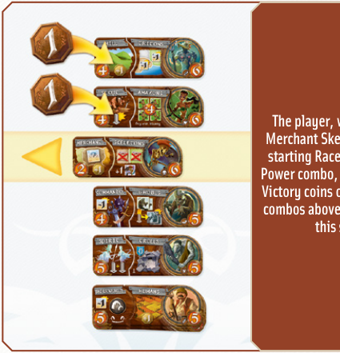

If the combo a player selects contains some Victory coins
(dropped by players who previously passed up this combo),
the player pockets these coins; he must still drop one of his
own Victory coins on each of the combos located above the
one he selected, however.

The player places his combo selection face up in front of him,
and picks a number of matching Race tokens in the removable
storage tray equal to the sum of the values indicated on the
Race banner and its associated Special Power badge.

Unless stated otherwise (for example, Skeletons or
Sorcerers) these Race tokens are the only ones the player will
be able to deploy for this race during the course of the game.

If, on the other hand, a Special Power (or Race power) lets
you take additional Race tokens from the storage tray during
the course of the game, you are still limited by the total

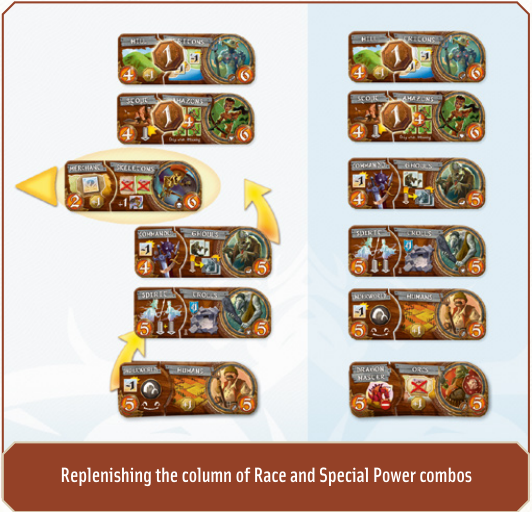
#### 2 3

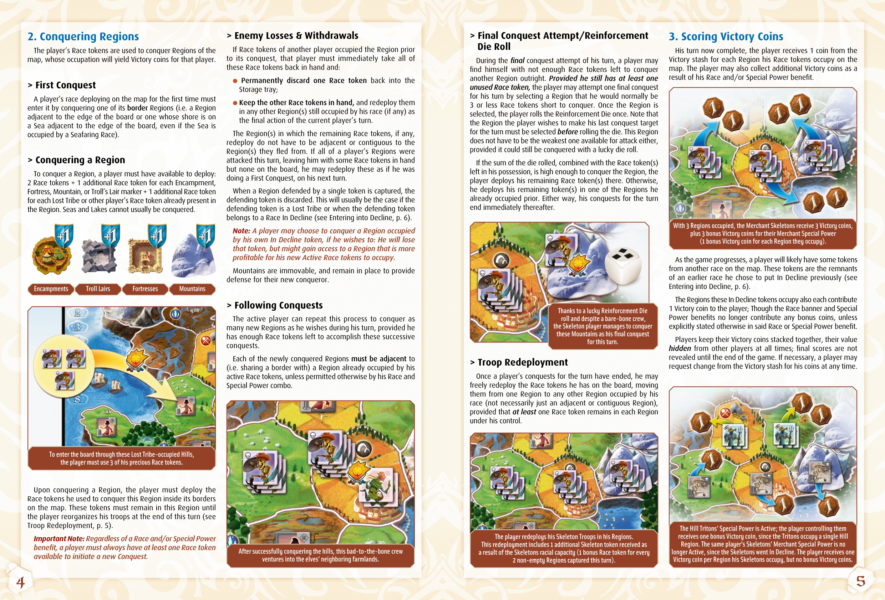

**> Final Conquest Attempt/Reinforcement**
**Die Roll**

During the _final_ conquest attempt of his turn, a player may
find himself with not enough Race tokens left to conquer
another Region outright. _Provided he still has at least one_
_unused Race token,_ the player may attempt one final conquest
for his turn by selecting a Region that he would normally be
3 or less Race tokens short to conquer. Once the Region is
selected, the player rolls the Reinforcement Die once. Note that
the Region the player wishes to make his last conquest target
for the turn must be selected _before_ rolling the die. This Region
does not have to be the weakest one available for attack either,
provided it could still be conquered with a lucky die roll.

If the sum of the die rolled, combined with the Race token(s)
left in his possession, is high enough to conquer the Region, the
player deploys his remaining Race token(s) there. Otherwise,
he deploys his remaining token(s) in one of the Regions he
already occupied prior. Either way, his conquests for the turn
end immediately thereafter.

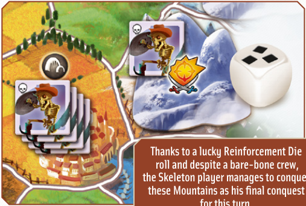

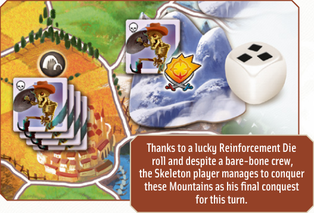

**> Troop Redeployment**

Once a player’s conquests for the turn have ended, he may
freely redeploy the Race tokens he has on the board, moving
them from one Region to any other Region occupied by his
race (not necessarily just an adjacent or contiguous Region),
provided that _at least_ one Race token remains in each Region
under his control.

###### **2. Conquering Regions**

The player’s Race tokens are used to conquer Regions of the
map, whose occupation will yield Victory coins for that player.

**> First Conquest**

A player’s race deploying on the map for the first time must
enter it by conquering one of its border Regions (i.e. a Region
adjacent to the edge of the board or one whose shore is on
a Sea adjacent to the edge of the board, even if the Sea is
occupied by a Seafaring Race).

**> Conquering a Region**

To conquer a Region, a player must have available to deploy:
2 Race tokens + 1 additional Race token for each Encampment,
Fortress, Mountain, or Troll’s Lair marker + 1 additional Race token
for each Lost Tribe or other player’s Race token already present in
the Region. Seas and Lakes cannot usually be conquered.

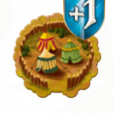

Encampments Troll Lairs Fortresses Mountains

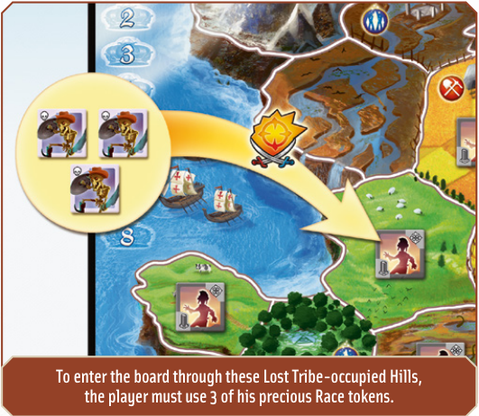

Upon conquering a Region, the player must deploy the
Race tokens he used to conquer this Region inside its borders
on the map. These tokens must remain in this Region until
the player reorganizes his troops at the end of this turn (see
Troop Redeployment, p. 5).

_**Important Note:**_ _Regardless of a Race and/or Special Power_
_benefit, a player must always have at least one Race token_
_available to initiate a new Conquest._

**> Enemy Losses & Withdrawals**

If Race tokens of another player occupied the Region prior
to its conquest, that player must immediately take all of
these Race tokens back in hand and:

l Permanently discard one Race token back into the
Storage tray;

l Keep the other Race tokens in hand, and redeploy them
in any other Region(s) still occupied by his race (if any) as
the final action of the current player’s turn.

The Region(s) in which the remaining Race tokens, if any,
redeploy do not have to be adjacent or contiguous to the
Region(s) they fled from. If all of a player’s Regions were
attacked this turn, leaving him with some Race tokens in hand
but none on the board, he may redeploy these as if he was
doing a First Conquest, on his next turn.

When a Region defended by a single token is captured, the
defending token is discarded. This will usually be the case if the
defending token is a Lost Tribe or when the defending token
belongs to a Race In Decline (see Entering into Decline, p. 6).

_**Note:**_ _A player may choose to conquer a Region occupied_
_by his own In Decline token, if he wishes to: He will lose_
_that token, but might gain access to a Region that is more_
_profitable for his new Active Race tokens to occupy._

Mountains are immovable, and remain in place to provide
defense for their new conqueror.

**> Following Conquests**

The active player can repeat this process to conquer as
many new Regions as he wishes during his turn, provided he
has enough Race tokens left to accomplish these successive
conquests.

Each of the newly conquered Regions must be adjacent to
(i.e. sharing a border with) a Region already occupied by his
active Race tokens, unless permitted otherwise by his Race and
Special Power combo.

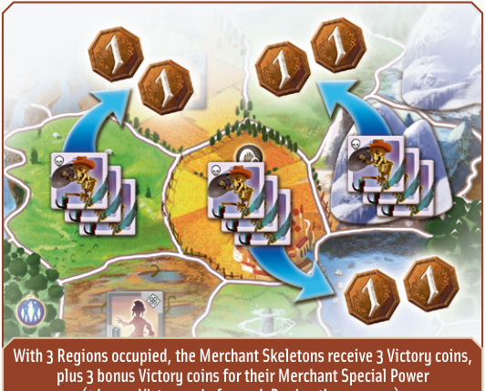

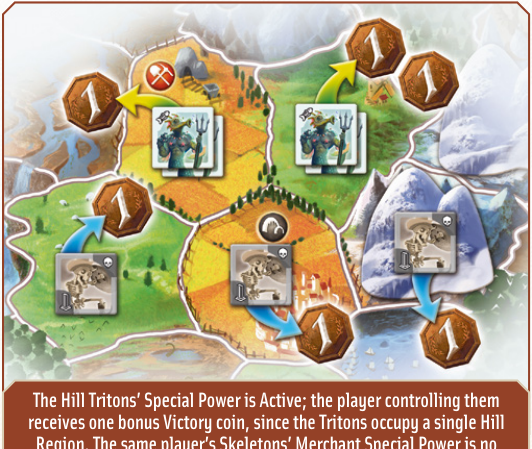

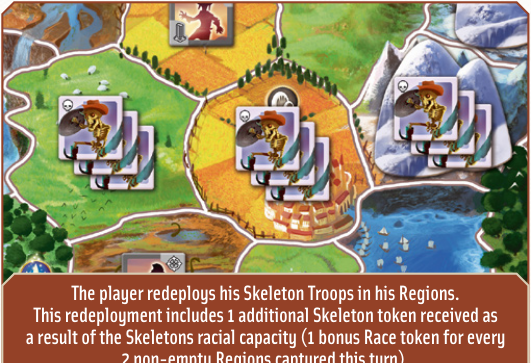

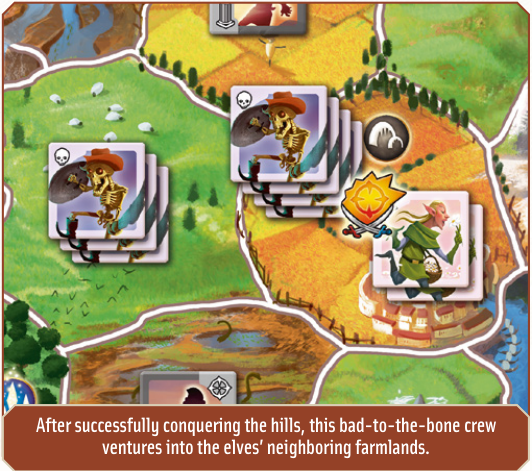

This redeployment includes 1 additional Skeleton token received as Region. The same player’s Skeletons’ Merchant Special Power is no

After successfully conquering the hills, this bad-to-the-bone crew a result of the Skeletons racial capacity (1 bonus Race token for every longer Active, since the Skeletons went In Decline. The player receives one
ventures into the elves’ neighboring farmlands. 2 non-empty Regions captured this turn). Victory coin per Region his Skeletons occupy, but no bonus Victory coins.

###### **3. Scoring Victory Coins**

His turn now complete, the player receives 1 coin from the
Victory stash for each Region his Race tokens occupy on the
map. The player may also collect additional Victory coins as a
result of his Race and/or Special Power benefit.

(1 bonus Victory coin for each Region they occupy).

As the game progresses, a player will likely have some tokens
from another race on the map. These tokens are the remnants
of an earlier race he chose to put In Decline previously (see
Entering into Decline, p. 6).

The Regions these In Decline tokens occupy also each contribute
1 Victory coin to the player; Though the Race banner and Special
Power benefits no longer contribute any bonus coins, unless
explicitly stated otherwise in said Race or Special Power benefit.

Players keep their Victory coins stacked together, their value
_hidden_ from other players at all times; final scores are not
revealed until the end of the game. If necessary, a player may
request change from the Victory stash for his coins at any time.

#### 4 5

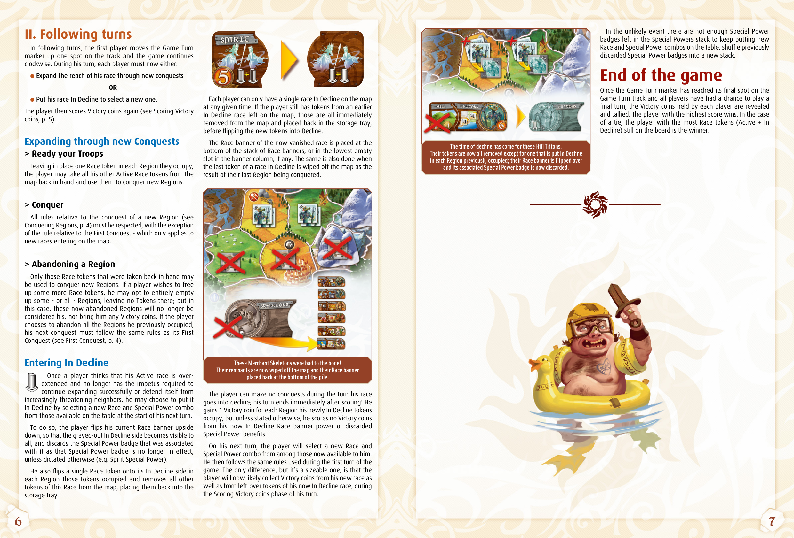
### **II. Following turns**

In following turns, the first player moves the Game Turn
marker up one spot on the track and the game continues
clockwise. During his turn, each player must now either:

l Expand the reach of his race through new conquests

**OR**

l Put his race In Decline to select a new one.

The player then scores Victory coins again (see Scoring Victory
coins, p. 5).

###### **Expanding through new Conquests**

**> Ready your Troops**

Leaving in place one Race token in each Region they occupy,
the player may take all his other Active Race tokens from the
map back in hand and use them to conquer new Regions.

**> Conquer**

All rules relative to the conquest of a new Region (see
Conquering Regions, p. 4) must be respected, with the exception
of the rule relative to the First Conquest - which only applies to
new races entering on the map.

**> Abandoning a Region**

Only those Race tokens that were taken back in hand may
be used to conquer new Regions. If a player wishes to free
up some more Race tokens, he may opt to entirely empty
up some - or all - Regions, leaving no Tokens there; but in
this case, these now abandoned Regions will no longer be
considered his, nor bring him any Victory coins. If the player
chooses to abandon all the Regions he previously occupied,
his next conquest must follow the same rules as its First
Conquest (see First Conquest, p. 4).

###### **Entering In Decline**

Once a player thinks that his Active race is overextended and no longer has the impetus required to
continue expanding successfully or defend itself from
increasingly threatening neighbors, he may choose to put it
In Decline by selecting a new Race and Special Power combo
from those available on the table at the start of his next turn.

To do so, the player flips his current Race banner upside
down, so that the grayed-out In Decline side becomes visible to
all, and discards the Special Power badge that was associated
with it as that Special Power badge is no longer in effect,
unless dictated otherwise (e.g. Spirit Special Power).

He also flips a single Race token onto its In Decline side in
each Region those tokens occupied and removes all other
tokens of this Race from the map, placing them back into the
storage tray.

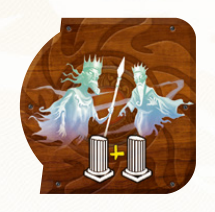

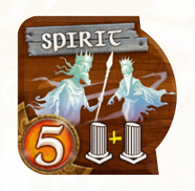

Each player can only have a single race In Decline on the map
at any given time. If the player still has tokens from an earlier
In Decline race left on the map, those are all immediately
removed from the map and placed back in the storage tray,
before flipping the new tokens into Decline.

The Race banner of the now vanished race is placed at the
bottom of the stack of Race banners, or in the lowest empty
slot in the banner column, if any. The same is also done when
the last token of a race In Decline is wiped off the map as the
result of their last Region being conquered.

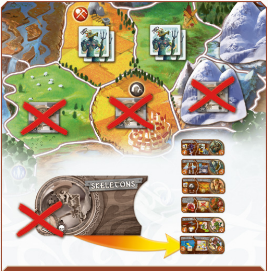

These Merchant Skeletons were bad to the bone!
Their remnants are now wiped off the map and their Race banner
placed back at the bottom of the pile.

The player can make no conquests during the turn his race
goes into decline; his turn ends immediately after scoring! He
gains 1 Victory coin for each Region his newly In Decline tokens
occupy, but unless stated otherwise, he scores no Victory coins
from his now In Decline Race banner power or discarded
Special Power benefits.

On his next turn, the player will select a new Race and
Special Power combo from among those now available to him.
He then follows the same rules used during the first turn of the
game. The only difference, but it’s a sizeable one, is that the
player will now likely collect Victory coins from his new race as
well as from left-over tokens of his now In Decline race, during
the Scoring Victory coins phase of his turn.

In the unlikely event there are not enough Special Power
badges left in the Special Powers stack to keep putting new
Race and Special Power combos on the table, shuffle previously
discarded Special Power badges into a new stack.

## **End of the game**

Once the Game Turn marker has reached its final spot on the
Game Turn track and all players have had a chance to play a
final turn, the Victory coins held by each player are revealed
and tallied. The player with the highest score wins. In the case
of a tie, the player with the most Race tokens (Active + In
Decline) still on the board is the winner.

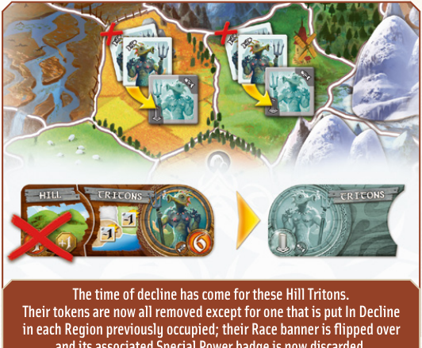

#### 6 7

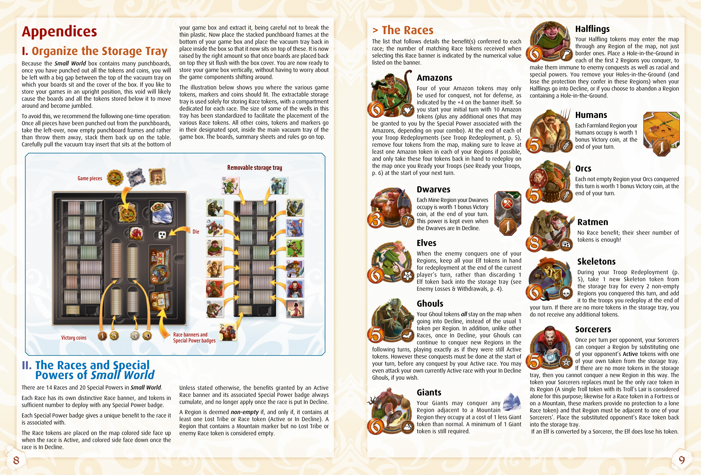
## **Appendices**

### **I. Organize the Storage Tray**

Because the _Small World_ box contains many punchboards,
once you have punched out all the tokens and coins, you will
be left with a big gap between the top of the vacuum tray on
which your boards sit and the cover of the box. If you like to
store your games in an upright position, this void will likely
cause the boards and all the tokens stored below it to move
around and become jumbled.

To avoid this, we recommend the following one-time operation:
Once all pieces have been punched out from the punchboards,
take the left-over, now empty punchboard frames and rather
than throw them away, stack them back up on the table.
Carefully pull the vacuum tray insert that sits at the bottom of

your game box and extract it, being careful not to break the
thin plastic. Now place the stacked punchboard frames at the
bottom of your game box and place the vacuum tray back in
place inside the box so that it now sits on top of these. It is now
raised by the right amount so that once boards are placed back
on top they sit flush with the box cover. You are now ready to
store your game box vertically, without having to worry about
the game components shifting around.

The illustration below shows you where the various game
tokens, markers and coins should fit. The extractable storage
tray is used solely for storing Race tokens, with a compartment
dedicated for each race. The size of some of the wells in this
tray has been standardized to facilitate the placement of the
various Race tokens. All other coins, tokens and markers go
in their designated spot, inside the main vacuum tray of the
game box. The boards, summary sheets and rules go on top.

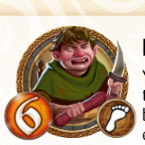
###### **Halflings**

Your Halfling tokens may enter the map
through any Region of the map, not just
border ones. Place a Hole-in-the-Ground in
each of the first 2 Regions you conquer, to
make them immune to enemy conquests as well as racial and
special powers. You remove your Holes-in-the-Ground (and
lose the protection they confer in these Regions) when your
Halflings go into Decline, or if you choose to abandon a Region
containing a Hole-in-the-Ground.

###### **Humans**

Each Farmland Region your
Humans occupy is worth 1
bonus Victory coin, at the
end of your turn.

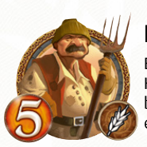

###### **Orcs**

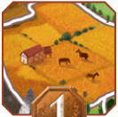

Each not empty Region your Orcs conquered
this turn is worth 1 bonus Victory coin, at the
end of your turn.

###### **Ratmen**

No Race benefit; their sheer number of
tokens is enough!

###### **Skeletons**

During your Troop Redeployment (p.
5), take 1 new Skeleton token from
the storage tray for every 2 non-empty
Regions you conquered this turn, and add
it to the troops you redeploy at the end of

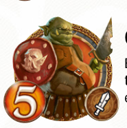

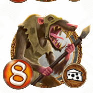

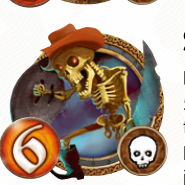
your turn. If there are no more tokens in the storage tray, you
do not receive any additional tokens.

###### **Sorcerers**

Once per turn per opponent, your Sorcerers
can conquer a Region by substituting one
of your opponent’s Active tokens with one
of your own taken from the storage tray.
If there are no more tokens in the storage

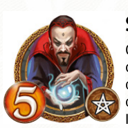
tray, then you cannot conquer a new Region in this way. The
token your Sorcerers replaces must be the only race token in
its Region (A single Troll token with its Troll’s Lair is considered
alone for this purpose; likewise for a Race token in a Fortress or
on a Mountain, these markers provide no protection to a lone
Race token) and that Region must be adjacent to one of your
Sorcerers’. Place the substituted opponent’s Race token back
into the storage tray.
If an Elf is converted by a Sorcerer, the Elf does lose his token.

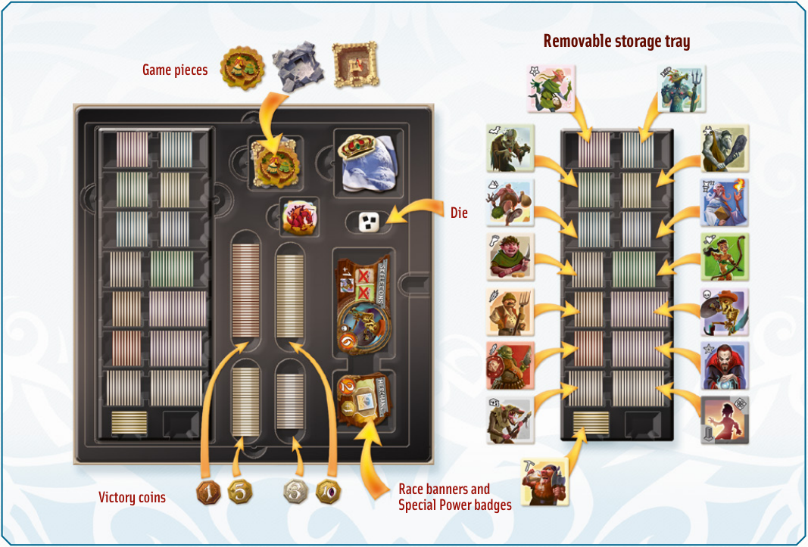
### **II. The Races and Special** **Powers of Small World**

### **> The Races**

The list that follows details the benefit(s) conferred to each
race; the number of matching Race tokens received when
selecting this Race banner is indicated by the numerical value
listed on the banner.

###### **Amazons**

Four of your Amazon tokens may only
be used for conquest, not for defense, as
indicated by the +4 on the banner itself. So
you start your initial turn with 10 Amazon
tokens (plus any additional ones that may

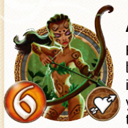
be granted to you by the Special Power associated with the
Amazons, depending on your combo). At the end of each of
your Troop Redeployments (see Troop Redeployment, p. 5),
remove four tokens from the map, making sure to leave at
least one Amazon token in each of your Regions if possible,
and only take these four tokens back in hand to redeploy on
the map once you Ready your Troops (see Ready your Troops,
p. 6) at the start of your next turn.

###### **Dwarves**

Each Mine Region your Dwarves
occupy is worth 1 bonus Victory
coin, at the end of your turn.
This power is kept even when
the Dwarves are In Decline.

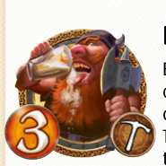

###### **Elves**

When the enemy conquers one of your
Regions, keep all your Elf tokens in hand
for redeployment at the end of the current
player’s turn, rather than discarding 1
Elf token back into the storage tray (see

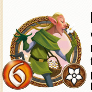
Enemy Losses & Withdrawals, p. 4).

###### **Ghouls**

Your Ghoul tokens _all_ stay on the map when
going into Decline, instead of the usual 1
token per Region. In addition, unlike other
Races, once In Decline, your Ghouls can
continue to conquer new Regions in the

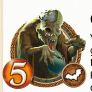
following turns, playing exactly as if they were still Active
tokens. However these conquests must be done at the start of
your turn, before any conquest by your Active race. You may
even attack your own currently Active race with your In Decline
Ghouls, if you wish.

###### **Giants**

Your Giants may conquer any
Region adjacent to a Mountain
Region they occupy at a cost of 1 less Giant
token than normal. A minimum of 1 Giant
token is still required.

There are 14 Races and 20 Special Powers in _Small World_ .

Each Race has its own distinctive Race banner, and tokens in
sufficient number to deploy with any Special Power badge.

Each Special Power badge gives a unique benefit to the race it
is associated with.

The Race tokens are placed on the map colored side face up
when the race is Active, and colored side face down once the
race is In Decline.

Unless stated otherwise, the benefits granted by an Active
Race banner and its associated Special Power badge always
cumulate, and no longer apply once the race is put In Decline.

A Region is deemed _non-empty_ if, and only if, it contains at
least one Lost Tribe or Race token (Active or In Decline). A
Region that contains a Mountain marker but no Lost Tribe or
enemy Race token is considered empty.

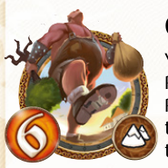
#### 8 9

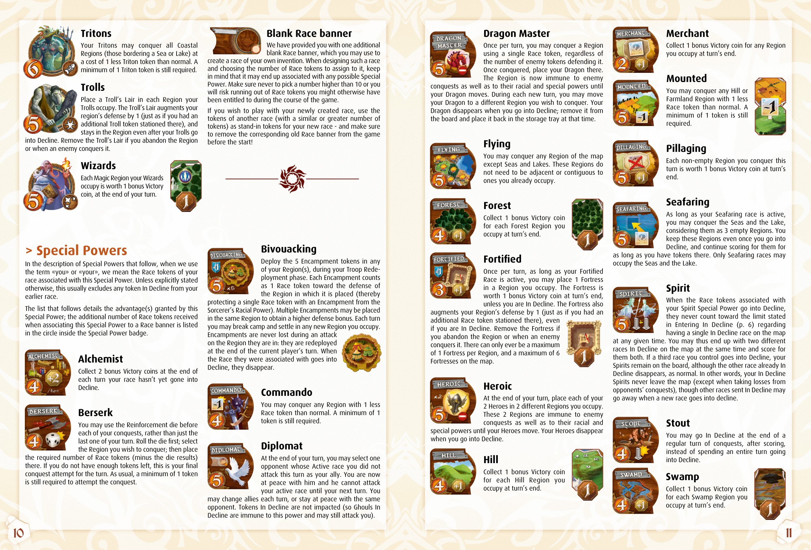

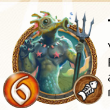
###### **Tritons**

Your Tritons may conquer all Coastal
Regions (those bordering a Sea or Lake) at
a cost of 1 less Triton token than normal. A
minimum of 1 Triton token is still required.

###### **Trolls**

Place a Troll’s Lair in each Region your
Trolls occupy. The Troll’s Lair augments your
region’s defense by 1 (just as if you had an
additional Troll token stationed there), and
stays in the Region even after your Trolls go

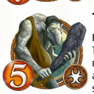
into Decline. Remove the Troll’s Lair if you abandon the Region
or when an enemy conquers it.

###### **Wizards**

Each Magic Region your Wizards
occupy is worth 1 bonus Victory
coin, at the end of your turn.

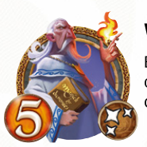

### **> Special Powers**

In the description of Special Powers that follow, when we use
the term «you» or «your», we mean the Race tokens of your
race associated with this Special Power. Unless explicitly stated
otherwise, this usually excludes any token In Decline from your
earlier race.

The list that follows details the advantage(s) granted by this
Special Power; the additional number of Race tokens received
when associating this Special Power to a Race banner is listed
in the circle inside the Special Power badge.

###### **Alchemist**

Collect 2 bonus Victory coins at the end of
each turn your race hasn’t yet gone into
Decline.

###### **Berserk**

You may use the Reinforcement die before
each of your conquests, rather than just the
last one of your turn. Roll the die first; select
the Region you wish to conquer; then place

the required number of Race tokens (minus the die results)

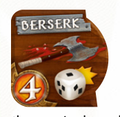
there. If you do not have enough tokens left, this is your final
conquest attempt for the turn. As usual, a minimum of 1 token
is still required to attempt the conquest.

###### **Blank Race banner**

We have provided you with one additional
blank Race banner, which you may use to
create a race of your own invention. When designing such a race
and choosing the number of Race tokens to assign to it, keep
in mind that it may end up associated with any possible Special
Power. Make sure never to pick a number higher than 10 or you
will risk running out of Race tokens you might otherwise have
been entitled to during the course of the game.

If you wish to play with your newly created race, use the
tokens of another race (with a similar or greater number of
tokens) as stand-in tokens for your new race - and make sure
to remove the corresponding old Race banner from the game
before the start!

###### **Bivouacking**

Deploy the 5 Encampment tokens in any
of your Region(s), during your Troop Redeployment phase. Each Encampment counts
as 1 Race token toward the defense of
the Region in which it is placed (thereby

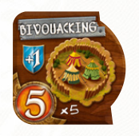
protecting a single Race token with an Encampment from the
Sorcerer’s Racial Power). Multiple Encampments may be placed
in the same Region to obtain a higher defense bonus. Each turn
you may break camp and settle in any new Region you occupy.
Encampments are never lost during an attack
on the Region they are in: they are redeployed
at the end of the current player’s turn. When
the Race they were associated with goes into
Decline, they disappear.

###### **Commando**

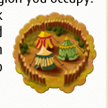

You may conquer any Region with 1 less
Race token than normal. A minimum of 1
token is still required.

###### **Diplomat**

At the end of your turn, you may select one
opponent whose Active race you did not
attack this turn as your ally. You are now
at peace with him and he cannot attack
your active race until your next turn. You

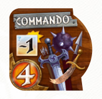

may change allies each turn, or stay at peace with the same
opponent. Tokens In Decline are not impacted (so Ghouls In
Decline are immune to this power and may still attack you).

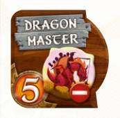
###### **Dragon Master**

Once per turn, you may conquer a Region
using a single Race token, regardless of
the number of enemy tokens defending it.
Once conquered, place your Dragon there.
The Region is now immune to enemy
conquests as well as to their racial and special powers until
your Dragon moves. During each new turn, you may move
your Dragon to a different Region you wish to conquer. Your
Dragon disappears when you go into Decline; remove it from
the board and place it back in the storage tray at that time.

###### **Flying**

You may conquer any Region of the map
except Seas and Lakes. These Regions do
not need to be adjacent or contiguous to
ones you already occupy.

###### **Forest**

Collect 1 bonus Victory coin
for each Forest Region you
occupy at turn’s end.

###### **Fortified**

Once per turn, as long as your Fortified
Race is active, you may place 1 Fortress
in a Region you occupy. The Fortress is
worth 1 bonus Victory coin at turn’s end,
unless you are In Decline. The Fortress also

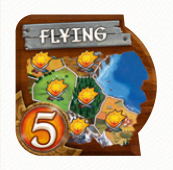

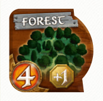

augments your Region’s defense by 1 (just as if you had an
additional Race token stationed there), even
if you are In Decline. Remove the Fortress if
you abandon the Region or when an enemy
conquers it. There can only ever be a maximum
of 1 Fortress per Region, and a maximum of 6
Fortresses on the map.

###### **Heroic**

At the end of your turn, place each of your
2 Heroes in 2 different Regions you occupy.
These 2 Regions are immune to enemy
conquests as well as to their racial and
special powers until your Heroes move. Your Heroes disappear

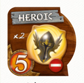
when you go into Decline.

###### **Hill**

Collect 1 bonus Victory coin
for each Hill Region you
occupy at turn’s end.

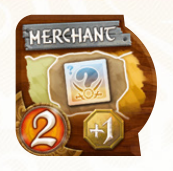
###### **Merchant**

Collect 1 bonus Victory coin for any Region
you occupy at turn’s end.

###### **Mounted**

You may conquer any Hill or
Farmland Region with 1 less
Race token than normal. A
minimum of 1 token is still
required.

###### **Pillaging**

Each non-empty Region you conquer this
turn is worth 1 bonus Victory coin at turn’s
end.

###### **Seafaring**

As long as your Seafaring race is active,
you may conquer the Seas and the Lake,
considering them as 3 empty Regions. You
keep these Regions even once you go into
Decline, and continue scoring for them for

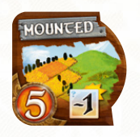

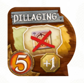
as long as you have tokens there. Only Seafaring races may

occupy the Seas and the Lake.

###### **Spirit**

When the Race tokens associated with
your Spirit Special Power go into Decline,
they never count toward the limit stated
in Entering In Decline (p. 6) regarding
having a single In Decline race on the map

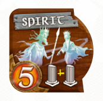
at any given time. You may thus end up with two different
races In Decline on the map at the same time and score for
them both. If a third race you control goes into Decline, your
Spirits remain on the board, although the other race already In
Decline disappears, as normal. In other words, your In Decline
Spirits never leave the map (except when taking losses from
opponents’ conquests), though other races sent In Decline may
go away when a new race goes into decline.

###### **Stout**

You may go In Decline at the end of a
regular turn of conquests, after scoring,
instead of spending an entire turn going
into Decline.

###### **Swamp**

Collect 1 bonus Victory coin
for each Swamp Region you
occupy at turn’s end.

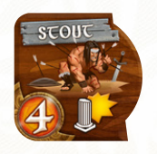

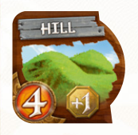

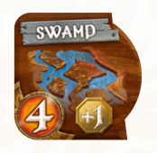
#### 10 11

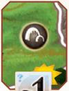

###### **Underworld**

You may conquer any Region
with a Cavern with 1 less Race

token than normal. A minimum
of 1 token is still required.

All Regions with a Cavern are also considered
adjacent to each other for your conquest purposes.

###### **Wealthy**

Collect 7 bonus Victory coins, once only, at
the end of your first turn.

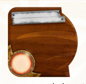
###### **Blank Special Power badge**

We have provided you with one additional
blank Special Power badge, which you may
use to create a Special Power of your own
invention. When designing such a Special
Power and choosing the number of Race tokens to associate
with it, keep in mind that it may end up associated with any
possible Race banner. Make sure never to pick a number
higher than 5 or you will risk running out of Race tokens you
might otherwise have been entitled to during the course of
the game.

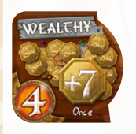

# **Days of Wonder Online**

of Bernard Jorion, Thomas Laroche, Vincent Piedboeuf, Yves Dohogne,
Stéphane Rimbert, Dom Vandaële, Fred Dieu, Benoît Kusters,
Alexis Keyaerts.

Additional thanks to Cédrick Caumont, Thomas Provoost,
Benjamin Slinger, Jean-Pierre Ernotte, Stéphane Van Esbeek,
Iris Fostiez, the members of the Repos, Tripot, Gang of Our
and Alpaludismes play groups, and the attendees
of the Rencontres Ludopathiques, Belgoludique,
Efpé WE and Rubrouck game conventions.

And a special thanks to Xavier Georges and Alain
Gotcheiner for their suggestions and contributions.

Last, but not least, Days of Wonder wishes to thank
Bruno Cathala for calling our attention to this gem.

Days of Wonder, the Days of Wonder logo and
Small World - the boardgame are all trademarks
or registered trademarks of Days of Wonder, Inc.
and copyrights © 2009-2018 Days of Wonder, Inc. All Rights
reserved.

#### 12

